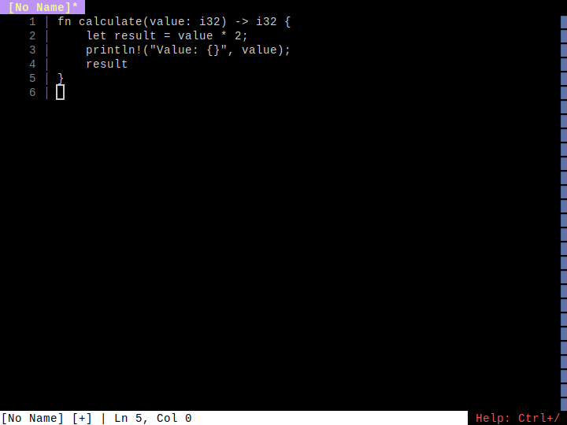
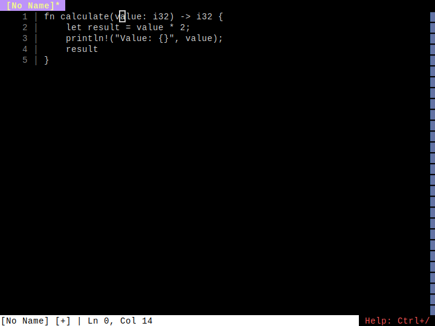
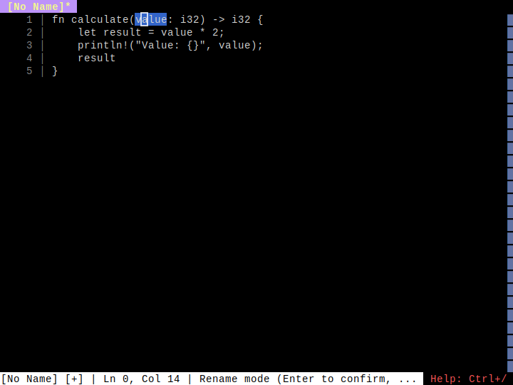
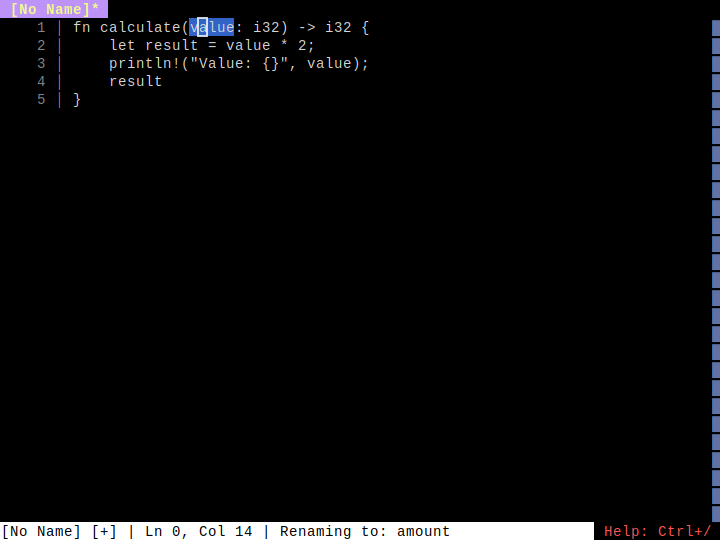
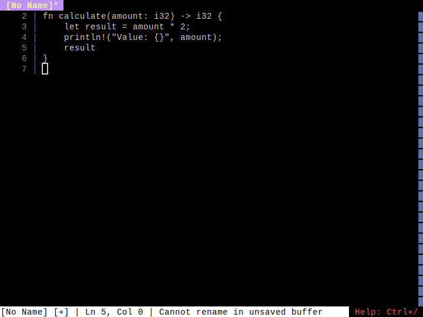

# LSP Rename

**Category**: LSP Features

*Renaming a symbol across multiple locations using F2*

---

## Step 1: initial_code

*Function with 'value' parameter used twice*

## Step 2: cursor_on_symbol

*Cursor positioned on 'value' parameter*

## Step 3: rename_mode_active

*Rename mode activated - 'value' highlighted in blue*

## Step 4: typing_new_name

*Typing new name 'amount' - live preview in editor*

## Step 5: rename_complete

*Rename complete - all 3 occurrences of 'value' renamed to 'amount'*

